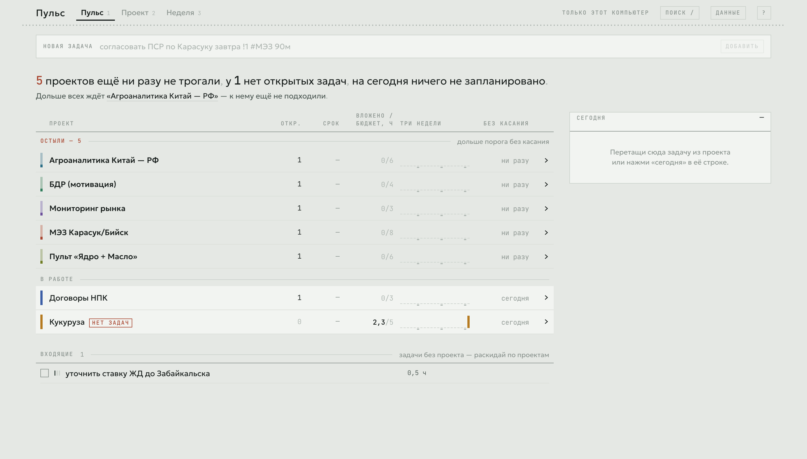
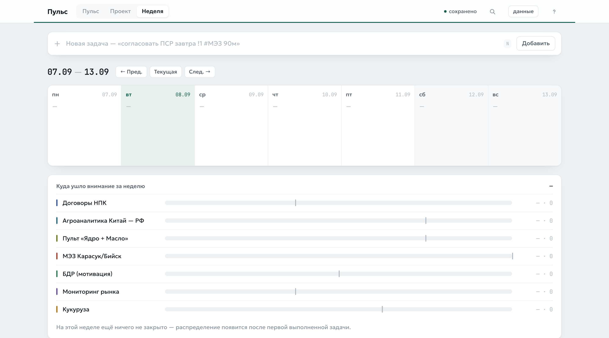
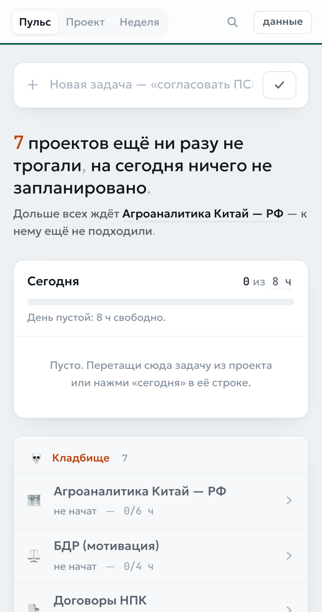

# Пульс

**https://gorbatovroman86-coder.github.io/pulse-planner/**

Персональный планер для одного человека, который ведёт семь-девять тяжёлых проектов
одновременно и теряет из виду те, к которым давно не подходил.

Приложение отвечает на два вопроса с одного экрана: **какой проект я забросил** и
**чем я занимаюсь сегодня**. Задачи и внимание к проектам — одна сущность: пульс проекта
не задаётся руками, а считается из выполненных задач.

## Визуальное направление

Выбрано направление **«ведомость»**: холодная каменная бумага, графитные чернила,
приглушённые пигменты проектов и моноширинные цифры. Всё содержимое выровнено по колонкам,
как в приёмной ведомости или лабораторном журнале — родном языке предметной области.

Отвергнуты два других направления:

- **тёплая бумага с контрастной антиквой и терракотой** — это то, что нейросеть выдаёт
  по умолчанию на любой бриф, и оно не решает главную задачу: сравнить девять проектов
  по одинаковым колонкам;
- **тёмный пульт с одним кислотным акцентом** — девять цветов проектов на тёмном фоне
  приходится делать яркими, и экран превращается в гирлянду; вдобавок это второй
  типовой ответ нейросети.

Подробности решений и оценки по пяти критериям — в [DECISIONS.md](./DECISIONS.md).

Шрифты: **Geologica** (текст, заголовки) и **JetBrains Mono** (все числа, даты,
длительности). Оба лежат в сборке — интернет для отрисовки не нужен.



## Экраны

### 1. Пульс

Главный экран, здесь проходит почти всё время.

- **Ведомость проектов** — строка на проект: пигмент, название, число открытых задач,
  ближайший срок, вложено/бюджет, лента трёх недель, дней без касания.
- **Лента трёх недель** — столбик на каждый день, высота равна закрытым за день часам.
  Провал в работе виден как пустой хвост, читать текст не нужно. Засечки внизу — понедельники.
- **Пигмент слева** — столбик уровня внимания: полный у свежего проекта, осевший к донышку
  у остывшего.
- Остывшие проекты (порог по умолчанию 7 дней) собраны наверху под подписью «остыли — N».
  Проект без единой открытой задачи получает метку «нет задач», даже если касание было вчера.
- **Строка-вывод** сверху: сколько проектов остыло и сколько часов запланировано на сегодня.
  Ниже — имя самого забытого проекта; клик по нему раскрывает его строку.
- **Разворот строки** — открытые задачи проекта, добавление задачи прямо сюда,
  кнопка «отметить касание» и переход на экран проекта.
- **Колонка «Сегодня»** справа: сумма часов сверху, перетаскивание для порядка,
  предупреждение при превышении шести часов.
- **Входящие** внизу — задачи без проекта, с выпадающим списком для раскладки по проектам.

### 2. Проект

Все задачи одного проекта, сгруппированные по статусу, включая выполненные.
Инлайн-редактирование названия и описания, настройка недельного бюджета и порога остывания,
история по неделям: сколько задач и часов закрыто.

### 3. Неделя

Семь колонок по дням со сроками задач, просроченное — отдельным блоком сверху.
Внизу — распределение фактически вложенных часов по проектам за неделю: сразу видно перекос
внимания. Ось общая для всех проектов, тонкая засечка на полосе — недельный бюджет.





## Как считается пульс

- **Вложено часов за неделю** — сумма оценок задач проекта, выполненных с понедельника
  текущей недели.
- **Последнее касание** — максимум из даты последнего выполнения задачи и ручной отметки.
- **Отметить касание** — для работы без задачи (созвон, чтение, поездка): дата обновляется,
  часы не растут.
- **Провисающий проект** — без единой открытой задачи, помечается отдельно.

## Быстрый ввод

Поле вверху всегда на месте, по клавише `N` в него встаёт курсор.
Разбор показывается подсказкой под полем **до** создания задачи.

```
согласовать ПСР по Карасуку завтра !1 #МЭЗ 90м
```

| Что пишем | Что получается |
|---|---|
| `сегодня`, `завтра`, `послезавтра` | срок |
| `пн` … `вс`, `понедельник` … `воскресенье` | ближайший такой день |
| `14.09`, `14.09.2026` | срок датой |
| `!1` `!2` `!3` | приоритет |
| `#МЭЗ` | проект по началу названия |
| `90м`, `45 мин`, `2ч`, `1,5 ч` | оценка |

Если проект не указан или не нашёлся — задача падает во «Входящие», а не теряется.

## Клавиши

`N` новая задача · `1` `2` `3` экраны · `/` поиск · `?` список клавиш ·
`↑` `↓` выбор задачи в «Сегодня» · `пробел` отметить выполненной · `Esc` закрыть.

## Как зайти

Открыть адрес, ввести почту, нажать «прислать ссылку», открыть письмо на этом же
компьютере. Пароля нет. С нового компьютера — то же самое: данные подтянутся из облака.

## Как запустить локально

```bash
npm install
npm run dev
```

Открыть http://localhost:5173

## Где данные

Данные живут в облаке (Supabase), а в браузере лежит их кэш. Порядок работы такой:

1. Любое действие мгновенно меняет состояние и пишется в браузер — интерфейс никогда
   не ждёт сеть.
2. Изменение уходит в облако фоновой очередью.
3. Нет интернета — работа продолжается, изменения копятся и уходят при восстановлении связи.
4. При открытии страницы сначала показывается кэш, затем подтягивается облако.
5. Конфликты решаются по времени изменения: побеждает более позднее. Удаление мягкое,
   флагом, чтобы удалённое на одном компьютере не воскресало со второго.

**Индикатор состояния** — линия под шапкой и короткое слово рядом:
сплошная «сохранено», бегущий пунктир «сохраняю», редкий штрих «нет сети — N изменений ждут»,
рваная красная «ошибка синхронизации».

Если ключи Supabase не заданы, приложение работает целиком на этом компьютере
и честно пишет об этом: «только этот компьютер».

## Бэкап

- **Ночная копия** — GitHub Actions каждый день в 03:00 по Новосибирску складывает срез
  обеих таблиц в приватный репозиторий `pulse-planner-data`.
- **Ручная копия** — кнопка «Данные» → «Экспорт в JSON». Тот же формат, что у ночной копии.
- **Восстановление** — `npm run restore -- backups/latest.json`, подробности в
  [RECOVERY.md](./RECOVERY.md).

## Ключи

`.env` в репозиторий не попадает, образец — в `.env.example`.
В браузер уходят только адрес проекта и анонимный ключ; доступ к чужим данным закрыт
политиками Row Level Security. Service role key используется только в GitHub Actions
и в скриптах на компьютере.
